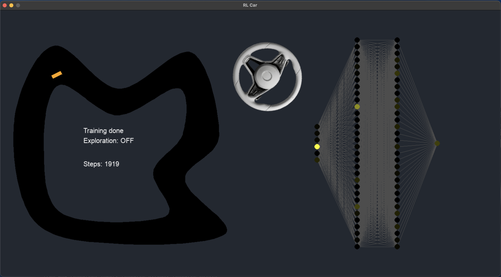

# Reinforcement Learning with DDPG (Deep Deterministic Policy Gradient)
Using the power of DDPG, this 2D car learns to drive (by steering the wheel) and follow the track without crashing.
Implemented with 4 neural networks: 2 networks for the **Actor** and 2 for the **Critic**. 

Updates are done on the Critic using the classic Bellman equation: Q(s,a) = r + gamma * max(Q(S',a')).
The Actor is updated such that it follows the Critic's gradient for that state, moving towards the best action (with the largest Q-value) in that particular state.

Even though DDPG turned to work pretty well for this car simulation, we gotta mention how sensitive it is to the hyperparameters. I had to tweak them a lot to get the algorithm to learn *anything* (like learn to drive for at least 100 steps without continuously crashing into the wall). The first time I ran it, I got to see some very small results after letting it run for at least 800-1000 episodes, and it was still not guaranteed to learn something in every run. After lowering the Actor's learning rate to 1e-5 (very small), increasing the Critic's lr to 1e-2 (to learn faster that crashing into the wall for 100 consecutive episodes is stupid lol) and deciding to not use the classic Polyak averaging with a tau = 0.001 for weight transfer between the online and target networks after every step, and instead sync the weights every 100 steps, with a tau = 0.8 (almost the full new trained weights), I was able too see faster convergence (at least 200-300 succesful steps per episode) after only 80-150 episodes, and getting the algorithm to complete a full lap after about 300-350 episodes (again, *not on every run*, but frequent enough to not go crazy while waiting for it to learn).

Gonna try implementing TD3 to see if I get it to learn faster. May also have to adjust the reward functions: it currently computes a higher reward if the car is closer to the center. No lap progress is being currently recorded, not yet.

Neural networks created with PyTorch and GUI with PyGame.

### Screenshot (neural network animation included!)


### Running the app
```
uv run ddpg.py
```